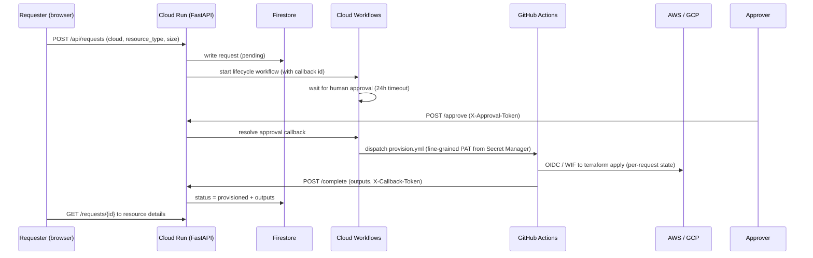

# Cloud Vending Machine

Request a resource on **AWS or GCP** through a web form, get it approved,
Terraform provisions it through GitHub Actions, and the requester gets
their resource back. Deprovisioning goes through the same approval gate.

| Layer | Technology | Status |
|-------|------------|--------|
| Portal UI + API | FastAPI on **Cloud Run** | Code-first (deploy-ready, applied with the GCP account) |
| Approval gate | **Cloud Workflows** (human-in-the-loop callback) | Code-first |
| Request store | **Firestore** | Code-first |
| Execution plane | **GitHub Actions + Terraform** (OIDC, no static keys) | AWS runnable today, GCP code-first |
| Provisionable | EC2 / S3 / IAM user · GCE / GCS / service account | AWS ready, GCP ready |


---

## Versioning and releases

Semantic versioning with git tags (`vMAJOR.MINOR.PATCH`). Pushing a tag runs
`release.yml`: full gates, image build with the version baked in, push to
Artifact Registry tagged with the version and the SHA, Cloud Run deploy when
GCP is live, and a GitHub Release. `/health` reports the running version.

```
git tag v1.2.0 && git push origin v1.2.0
```

Branching, commit conventions, and the security tooling map are in
[CONTRIBUTING.md](CONTRIBUTING.md). Quick version: trunk-based, PRs to main,
conventional commit prefixes, Dependabot on weekly updates.

## Architecture



Every provisioning step leaves a **public, linkable GitHub Actions run**
the approval flow is auditable by a recruiter without any dashboard access.

## Why GitHub Actions + Terraform as the execution plane?

Two options existed for "Cloud Run provisions AWS": call AWS APIs directly
from the container via GCPtoAWS workload identity federation, or dispatch
GitHub Actions and let Terraform do it. The second wins for this portfolio:

- **Terraform stays the single provisioning tool**, same modules, same
  state discipline as every other project here.
- **Reuses the OIDC provider already built** in terraform-bootstrap (zero
  new trust plumbing), with the **scoped `provision` role** (not admin).
- **Every approval produces a public audit artifact**, a linkable workflow
  run. A container doing API calls leaves no trace a recruiter can see.

The cost: one GitHub API hop, which needs a **fine-grained PAT** (scoped to
`actions: write` on this repo, stored in Secret Manager). It is the single
non-OIDC credential in the system, documented as a trade-off in
ADR-010.

## Provisionable resources

| Cloud | Resource | Notes |
|-------|----------|-------|
| AWS | `ec2` | Amazon Linux 2023, SSM-managed (no SSH keys), tagged `Patch Group=demo` so the cloud-patch-automation project patches it |
| AWS | `s3` | Private bucket, public access fully blocked |
| AWS | `iam_user` | `portal-*` namespace, read-only inline policy, access key returned once |
| GCP | `gce` | Debian 12, no external IP |
| GCP | `gcs` | Public access prevention enforced |
| GCP | `service_account` | `portal-sa-*` namespace, no project roles |

> **Limitation:** real GCP *user* provisioning needs Cloud Identity
> (a paid product). The GCP path provisions service accounts + buckets
> instead, the same approval pattern, without pretending about a product
> that isn't in scope.

## Security

- **Zero static cloud keys:** AWS = OIDC to scoped `provision` role (EC2/S3
  lifecycle, IAM users only in `portal-*`, state bucket only under
  `requests/`); GCP = Workload Identity Federation to CI service account.
- **Two layers of input validation:** pydantic allowlists in the API, and
  shell allowlists at the top of provision.yml (workflow_dispatch inputs are
  untrusted even when the API is not the caller).
- **The approval gate is a real gate:** pending requests sit in Firestore;
  nothing is dispatched until the callback resolves. Approve and reject are
  the same endpoint, deleting gets the same review as creating.
- **Pipeline gates:** ruff, pytest, pip-audit, CodeQL, Trivy (CRITICAL/HIGH
  block + SARIF), tflint, `terraform fmt -check`, actionlint. Dependabot
  keeps dependencies moving weekly. Full tooling map in CONTRIBUTING.md.
- **Approval/callback tokens + GitHub PAT** live in Secret Manager and are
  injected into Cloud Run as secret-backed env vars.

## Cost

Everything runs in GCP free tier at demo volume (Cloud Run scale-to-zero,
Workflows ~5k steps/mo, Firestore 1GB, Artifact Registry 0.5GB). A
`google_billing_budget` at **$10/mo** (50/90/100% alerts) is applied with
the platform. Portal-provisioned resources are requester-visible, every
request has a deprovision path, and per-request state is deleted on
deprovision.

## Status & what's code-first

The AWS execution path works **today**: the provision role, state bucket and
shared instance role already exist in terraform-bootstrap; you can run an
end-to-end provision **without the portal UI** via manual
`workflow_dispatch` (see [demo-script.md](docs/demo-script.md), Scenario B).

The GCP platform (Cloud Run, Firestore, Workflows, WIF, secrets, budget) is
**complete but not applied**, there is no GCP account on this project yet.
`platform-ci.yml` proves it deploy-ready on every PR (`terraform validate`,
zero credentials). When the account arrives, apply `platform/gcp` and the
portal is live. Runbook: [docs/local-dev.md](docs/local-dev.md#gcp-unblock-checklist).

## Local development

```bash
cd app
python -m venv .venv && source .venv/bin/activate
pip install -r requirements.txt -r requirements-dev.txt
APP_MODE=local uvicorn app.main:app --reload
# to http://localhost:8000  (in-memory store; approve with token "dev-approval-token")
pytest tests -q
```

## Repository map

```
app/                    # FastAPI portal (UI + API + Firestore repo + tests)
workflows/              # Cloud Workflows YAML (approval gate to GH dispatch)
platform/gcp/           # GCP foundation: Cloud Run, Firestore, Workflows, WIF,
                        #   Artifact Registry, Secret Manager, state bucket, budget
terraform/aws/          # per-request entry point (per-request S3 state)
terraform/gcp/          # per-request entry point (per-request GCS state)
terraform/modules/      # aws-request (ec2|s3|iam_user), gcp-request (gce|gcs|sa)
.github/workflows/      # app-ci, release, provision, deprovision, platform-ci
CONTRIBUTING.md         # branching, commits, semver releases, security tooling
docs/                   # architecture, local-dev, demo-script
```

> There is **no platform/aws directory**: the AWS side of the
> platform (provision role, state bucket, instance role, budgets) already
> lives in terraform-bootstrap, the portal adds nothing beyond per-request
> state there.
